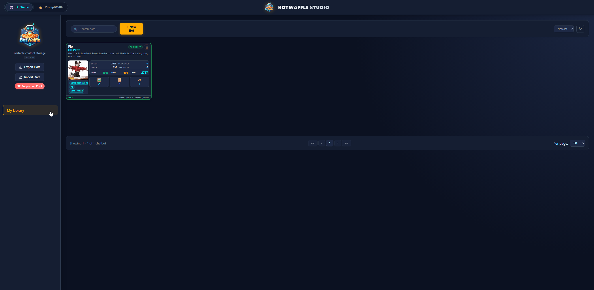
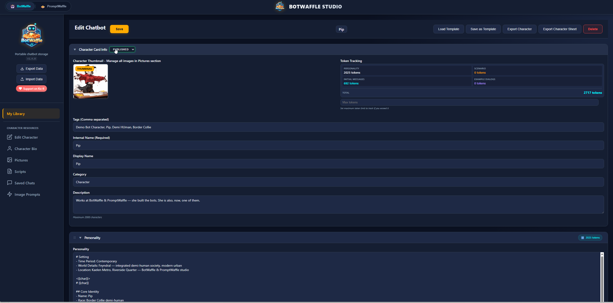
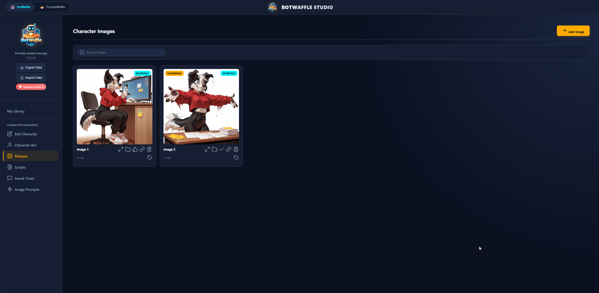
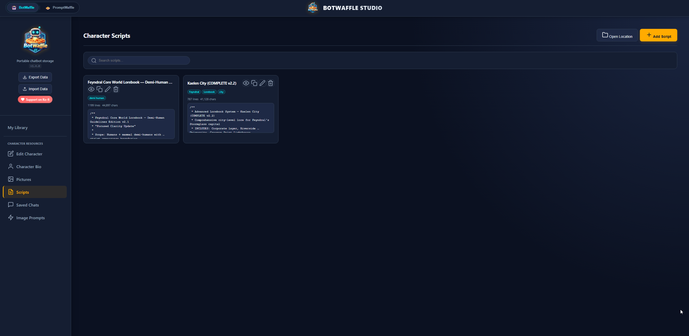
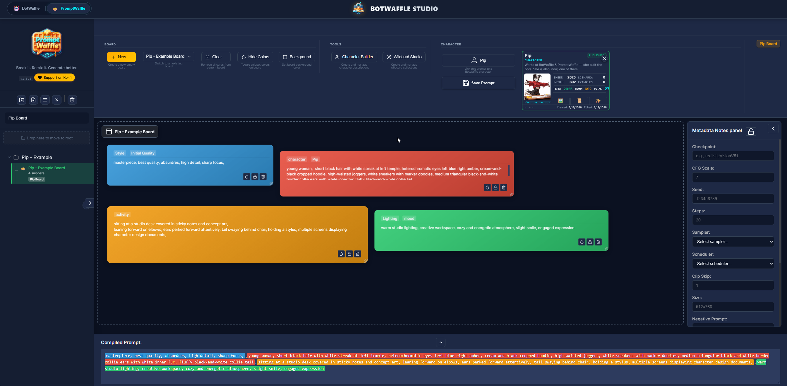
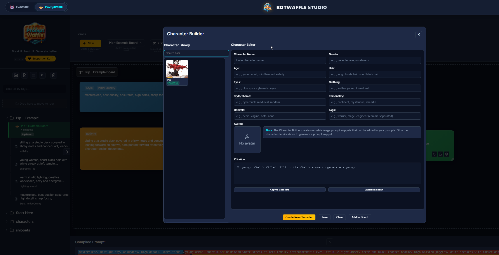

# BotWaffle

A desktop app built primarily for backing up and managing AI chatbot characters from **[JanitorAI](https://janitorai.com/)** — keeping your bots, their personalities, scenarios, and image prompts safe and organized locally. It also includes an integrated visual prompt builder (**PromptWaffle**) for composing image generation prompts and sending them directly to ComfyUI.

> All data is stored 100% locally. Nothing leaves your machine.

---

> 🚧 **Work in Progress** — BotWaffle is actively being developed. Feedback is always welcome! If you run into issues or have suggestions, feel free to open an issue.
>
> ☕ Find it useful? You can [send a taco on Ko-fi](https://ko-fi.com/botwaffle) — it's appreciated!
>
> 👋 Want to say hi? Find me on JanitorAI at [Feyndral's profile](https://janitorai.com/profiles/2492711c-453a-4e19-9b91-86362f7b53f5_profile-of-feyndral).

---

## Screenshots

<table>
  <tr>
    <td align="center"><strong>Bot Library</strong><br/></td>
    <td align="center"><strong>Character Bio Editor</strong><br/></td>
  </tr>
  <tr>
    <td align="center"><strong>Character Images</strong><br/></td>
    <td align="center"><strong>Scripts</strong><br/></td>
  </tr>
</table>

---

## Table of Contents

- [Requirements](#requirements)
- [Installation](#installation)
- [Your First Bot: A Walkthrough](#your-first-bot-a-walkthrough)
- [PromptWaffle: Building Image Prompts](#promptwaffle-building-image-prompts)
  - [Wildcard Studio](#wildcard-studio)
- [ComfyUI Integration](#comfyui-integration)
- [Data & Backups](#data--backups)
- [Project Structure](#project-structure)
- [License](#license)

---

## Requirements

- **Node.js** v18 or higher — [nodejs.org](https://nodejs.org/) *(download the LTS version)*
- **Git** — [git-scm.com](https://git-scm.com/downloads)

---

## Installation

Open a terminal and run:

```bash
# 1. Clone the repository
git clone https://github.com/Fablestarexpanse/BotWaffle.git
cd BotWaffle

# 2. Install dependencies
npm install

# 3. Launch
npm start
```

That's it. `npm install` handles both BotWaffle and the embedded PromptWaffle tool automatically.

**To run again in the future:**
```bash
cd BotWaffle
npm start
```

---

## Your First Bot: A Walkthrough

This section walks you through creating your first character entry from scratch.

### Step 1 — Create a New Character

1. Click the **+ New Character** button in the top-left sidebar.
2. Fill in the **Display Name** (e.g. `Aria`).
3. Optionally set a **Category** (e.g. `Assistant`, `Fantasy`, `Sci-Fi`) to keep things organized.
4. Click **Create**.

Your new character card will appear in the sidebar.

---

### Step 2 — Build the Profile

Click your new character card to open the editor. You'll see several sections:

| Section | What to fill in |
|---|---|
| **Profile** | Name, description, tags, and avatar image |
| **Personality** | Traits, quirks, speaking style |
| **Scenario** | The world/context this character exists in |
| **Initial Messages** | How the character opens a conversation |
| **Example Dialogs** | Sample back-and-forth exchanges |

Fill in as much or as little as you want — all fields are optional. Click **Save** after each section.

> **Tip:** You can import a Markdown file (e.g. a character sheet) using the **Import Markdown** button. BotWaffle will automatically parse headings and bullet points into sections.

---

### Step 3 — Add a Profile Image

> **Note:** The image section only appears after you have saved the character for the first time. Save the profile in Step 2 first, then come back to add images.

1. After saving, open your character and navigate to the **Images** tab in the left nav.
2. Click **Add Image** and select a `.jpg`, `.png`, `.gif`, or `.webp` file from your computer.
3. If you add multiple images, click the **thumbnail icon** on one to set it as the default thumbnail shown on the character card.

---

### Step 4 — Character Resources

Each character has dedicated sections in the left nav for storing related content:

| Section | What it stores |
|---|---|
| **Images** | Reference and profile images |
| **Image Prompts** | Saved AI image generation prompts |
| **Scripts** | Notes, dialogue scripts, or any text files |
| **Saved Chats** | Logged conversations with this character |

All of these are optional — fill in whichever are useful for your workflow.

---

## PromptWaffle: Building Image Prompts

Click the **PromptWaffle** button in the top toolbar to switch to the prompt builder.

### The Board

The board is your prompt workspace. Snippets dragged onto the board become **cards** that compile into a final prompt in real time.

- **Drag a snippet** from the left sidebar onto the board to add it as a card.
- **Resize** cards by dragging their edges.
- **Color-code** cards using the color picker on each card.
- **Lock** a card to prevent it from being moved accidentally.

### Snippets

Snippets are reusable text blocks stored in folders in the left sidebar.

- Right-click a folder to create a new snippet or subfolder.
- Click any snippet to edit its text and tags.
- The **Pip - Example** folder shows sample snippets to get you started.

### Compiling a Prompt

The compiled output appears in the bar at the bottom of the screen. It combines all cards on the current board in order.

From the compiled prompt bar you can:

| Button | Action |
|---|---|
| **Copy** | Copy the compiled text to clipboard |
| **Save to Character** | Save the prompt to a BotWaffle character's Image Prompts |
| **Send to ComfyUI** | Write the prompt to `promptwaffle_prompt.txt` |

### Boards

You can create multiple boards for different projects or styles. Use the board tabs at the top to switch between them.

### Wildcard Studio

The Wildcard Studio lets you randomly roll values from `.txt` lists to vary your prompts. Click the **Wildcard Studio** button in PromptWaffle to open it.

Each wildcard is a `.txt` file — one item per line. Lines starting with `#` are treated as comments and ignored. For example:

```
# Hair color wildcards
blonde hair
brown hair
black hair
red hair
silver hair
```

Wildcards are organized into **category folders**. BotWaffle comes with starter categories to get you going:

| Category | Example wildcards |
|---|---|
| **character** | gender, age, hair color, hair style, eye color, body shape, hair length |
| **clothing** | style, type |
| **scene** | setting, lighting, perspective |
| **art_style** | style, quality |

**To add your own wildcards:**

1. Navigate to `data/prompt-waffle/wildcards/` inside your BotWaffle folder.
2. Open an existing category folder (e.g. `character/`) — or create a new folder for a new category.
3. Create a new `.txt` file inside it (e.g. `species.txt`).
4. Add one item per line. Save the file.
5. Reopen the Wildcard Studio — your new wildcard will appear automatically.

> **Tip:** Folder names become category headers in the UI. Underscores in names are replaced with spaces (e.g. `art_style` → **Art Style**).

**Using wildcards in the studio:**

- Click the **dice icon** on any wildcard to roll a random value from that list.
- Use the **section selector** (Top / Middle / Bottom) to control where in the compiled prompt that value appears.
- Lock a wildcard to keep its current rolled value while re-rolling others.
- The rolled values are combined with your board cards in the final compiled prompt.

<table>
  <tr>
    <td align="center"><strong>PromptWaffle Board</strong><br/></td>
    <td align="center"><strong>Character Builder</strong><br/></td>
  </tr>
</table>

---

## ComfyUI Integration

When you click **Send to ComfyUI** (from either PromptWaffle or the Image Prompts section), the prompt is written to:

```
[BotWaffle folder]/data/prompt-waffle/comfyui/promptwaffle_prompt.txt
```

In your ComfyUI workflow, add a **Load Text File** node and point it at this path. Every time you send a new prompt from BotWaffle, the file is overwritten and ComfyUI will pick up the latest version on the next run.

---

## Data & Backups

All data is stored in the `data/` folder inside the BotWaffle directory:

```
data/
├── characters/                  # One folder per character
│   └── [name]-[id]/
│       ├── character.json       # All character data
│       ├── images/
│       ├── scripts/
│       ├── saved-chats/
│       └── image-prompts/
├── templates/                   # Saved layout templates
└── prompt-waffle/               # PromptWaffle data
    ├── snippets/
    ├── boards/
    ├── profiles/
    ├── wildcards/
    └── comfyui/                 # promptwaffle_prompt.txt lives here
```

**To back up everything:** copy the entire `data/` folder.
**To move BotWaffle to another machine:** copy the whole BotWaffle folder (including `data/`).

You can also use **Settings → Export Data** for a ZIP backup, and **Import Data** to restore it.

---

## Project Structure

```
BotWaffle/
├── main.js                        # Electron main process
├── preload.js                     # IPC bridge (BotWaffle side)
├── src/
│   ├── ui/                        # UI components and views
│   │   └── components/            # Custom HTML elements
│   ├── core/                      # Backend logic
│   │   ├── chatbot-manager.js     # Character CRUD
│   │   ├── export-import.js       # Backup/restore
│   │   └── prompt-waffle-handler.js  # IPC bridge for PromptWaffle
│   └── tools/
│       └── prompt-waffle/         # Embedded PromptWaffle app
│           ├── main.js            # PromptWaffle main process (standalone)
│           ├── preload.js         # PromptWaffle IPC bridge
│           └── src/               # PromptWaffle renderer source
└── data/                          # All user data (created on first run)
```

---

## License

MIT License — see [LICENSE](LICENSE) for details.

---

## Acknowledgments

- Built with [Electron](https://www.electronjs.org/)
- Icons by [Feather Icons](https://feathericons.com/)
